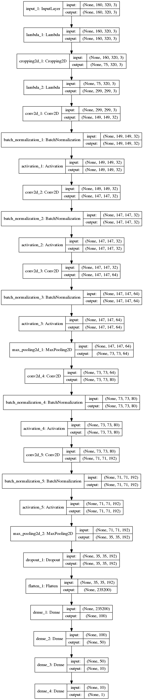

# **Behavioral Cloning** 
---

**Behavioral Cloning Project**

The goals / steps of this project are the following:
* Use the simulator to collect data of good driving behavior
* Build, a convolution neural network in Keras that predicts steering angles from images
* Train and validate the model with a training and validation set
* Test that the model successfully drives around track one without leaving the road
* Summarize the results with a written report

## Rubric Points
### Here I will consider the [rubric points](https://review.udacity.com/#!/rubrics/432/view) individually and describe how I addressed each point in my implementation.  

---
### Files Submitted & Code Quality

#### 1. Submission includes all required files and can be used to run the simulator in autonomous mode

My project includes the following files:
* * Main
* model.py containing the script to create and train the model featured NVIDIA's model
* drive.py for driving the car in autonomous mode
* model.h5 containing a trained convolution neural network
* writeup.md summarizing the results

* * Sub
* model_tl.py containing the script to create and train the model using transfer learing ( InceptionV3 )
* model_tl.h5 containing a trained convolution neural network

#### 2. Submission includes functional code
Using the Udacity provided simulator and my drive.py file, the car can be driven autonomously around the track by executing 
```sh
python drive.py model.h5
```

#### 3. Submission code is usable and readable

The model.py file contains the code for training and saving the convolution neural network. The file shows the pipeline I used for training and validating the model, and it contains comments to explain how the code works.

And for the code works, you have to install pydot and graphviz.
```sh
pip install pydot graphviz
```

### Model Architecture and Training Strategy

#### 1. An appropriate model architecture has been employed

My model consists of a convolution neural network with 1x1, 5x5 and 3x3 filter sizes and depths between 24 and 64 (model.py lines 157-163). 

1x1 convolution layer as first layer (code line 157) and ELU as activation funtion (code line 157 etc.) are added to the model to introduce nonlinearrity.

And the model includes The model contains dropout layers in order to reduce overfitting (code lines 166) and the data is normalized in the model using a Keras lambda layer (code line 153).

#### 2. Attempts to reduce overfitting in the model

The model was trained and validated on different data sets to ensure that the model was not overfitting (code line 183-184). The model was tested by running it through the simulator and ensuring that the vehicle could stay on the track.

#### 3. Model parameter tuning

The model used an adam optimizer, so the learning rate was not tuned manually (model.py line 180).

And loss function is MSE. So to derease error between predicted and true steering angle, the optimizer optimize model parameters.

#### 4. Appropriate training data

Training data was chosen to keep the vehicle driving on the road. I used a combination of center lane driving, recovering from the left and right sides of the road.

[Training data recored at track1](https://youtu.be/GsNV_fHJyI0)

[Training data recored at track2](https://youtu.be/bT1zx2h4iok)

For details about how I created the training data, see the next section. 

### Model Architecture and Training Strategy

#### 1. Solution Design Approach

My first step was to use a convolution neural network model similar to the [NVIDIA model](https://devblogs.nvidia.com/deep-learning-self-driving-cars/).

I thought this model might be appropriate because this was developed for autonomous driving.

First of all, 1x1 conv. layer ELU and dropout were added to the model. It could make the model to introduce nonlinearrity and not to overfit .

Next, the model was trained using dataset recorded at track1. Following image shows training result in 5 epoch.


Then, the model was tested two track.

[Tested at track1l](https://youtu.be/FCUiHn886-c)

[Tested at track2](https://youtu.be/SQEpGinTu6s)

The model worked well at track1(scene included in training data). But it didn't work at all at track2 (scene not included in training data).

So the model was trained again using dataset recorded at track2. Following image shows training result in 5 epoch.


Then, the model was tested two track.

[Tested at track1l](https://youtu.be/pyhaYlEJpZg)

[Tested at track2](https://youtu.be/Cl2_GEv3AM0)

Finally, the model drove autonomously at two track.

#### 2. Final Model Architecture

Here is a visualization of the architecture (note: visualizing the architecture is optional according to the project rubric)


#### 3. Creation of the Training Set & Training Process

To capture good driving behavior, I first recorded two laps on track one using center lane driving. Here is an example image of center lane driving:

![alt text][image2]

I then recorded the vehicle recovering from the left side and right sides of the road back to center so that the vehicle would learn to .... These images show what a recovery looks like starting from ... :

![alt text][image3]
![alt text][image4]
![alt text][image5]

Then I repeated this process on track two in order to get more data points.

To augment the data sat, I also flipped images and angles thinking that this would ... For example, here is an image that has then been flipped:

![alt text][image6]
![alt text][image7]

Etc ....

After the collection process, I had X number of data points. I then preprocessed this data by ...


I finally randomly shuffled the data set and put Y% of the data into a validation set. 

I used this training data for training the model. The validation set helped determine if the model was over or under fitting. The ideal number of epochs was Z as evidenced by ... I used an adam optimizer so that manually training the learning rate wasn't necessary.

### Transfer Learninig (Inception V3)

